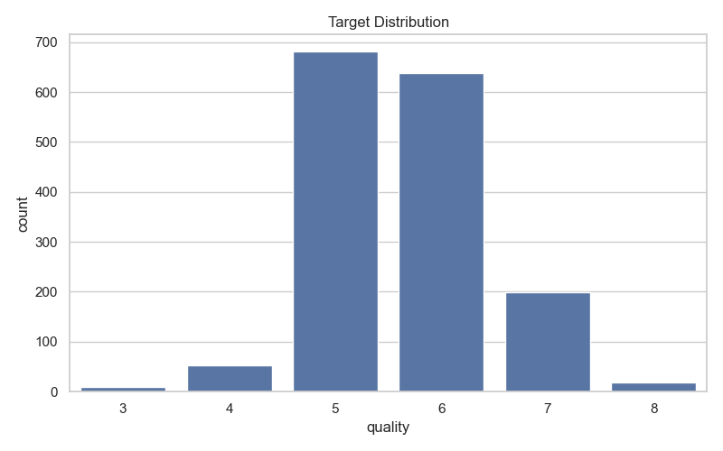
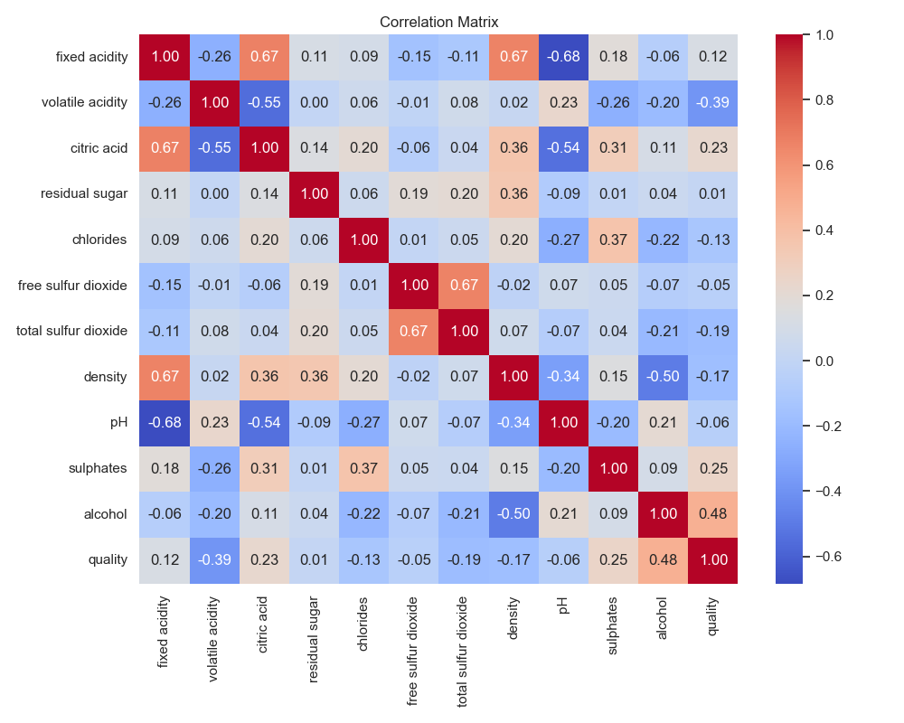
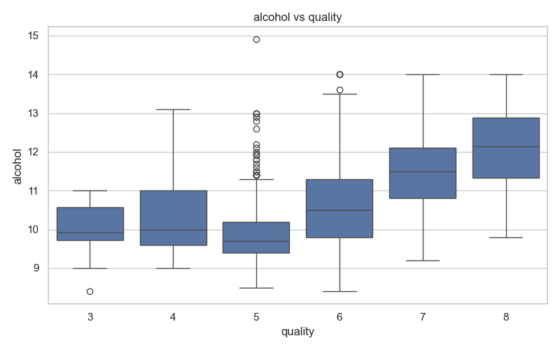
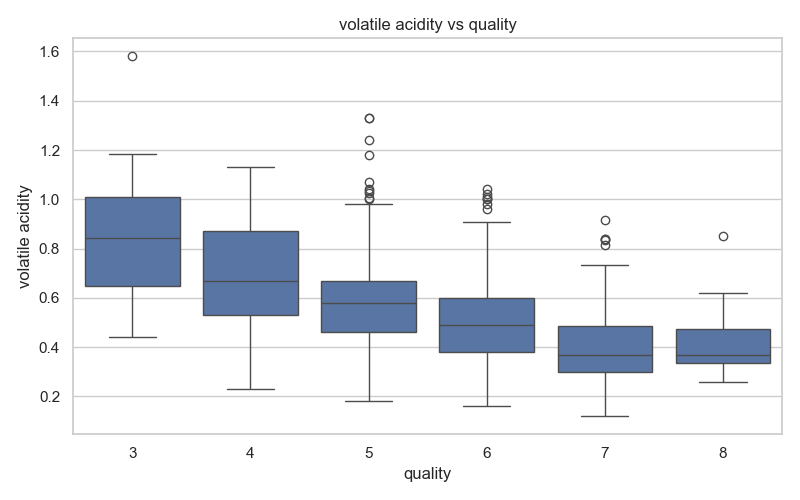
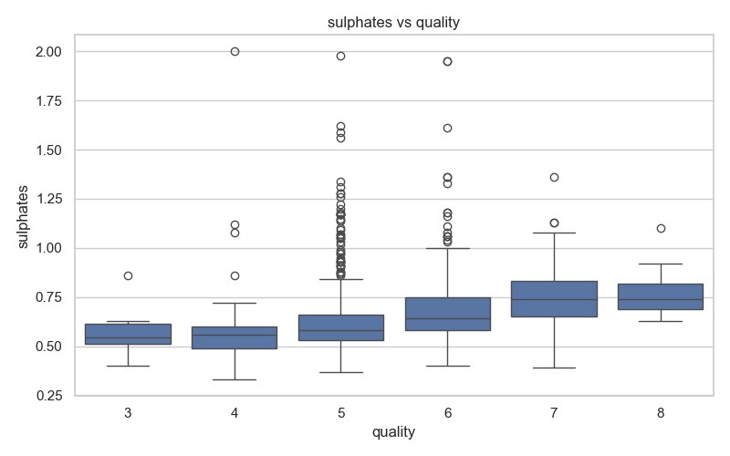
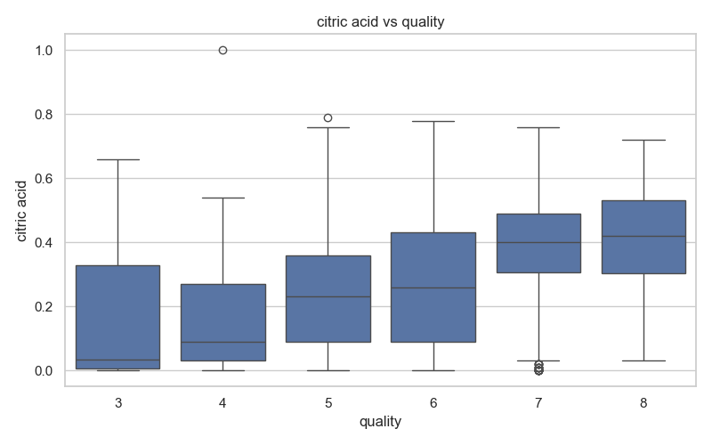
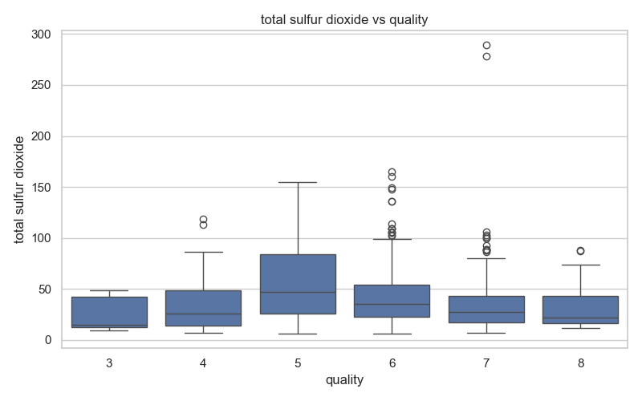

# Exploratory Data Analysis

## Dataset Shape
- Filas: 1599
- Columnas: 12

## Missing Values
|                      |   0 |
|:---------------------|----:|
| fixed acidity        |   0 |
| volatile acidity     |   0 |
| citric acid          |   0 |
| residual sugar       |   0 |
| chlorides            |   0 |
| free sulfur dioxide  |   0 |
| total sulfur dioxide |   0 |
| density              |   0 |
| pH                   |   0 |
| sulphates            |   0 |
| alcohol              |   0 |
| quality              |   0 |

## Data Types
|                      | dtype   |
|:---------------------|:--------|
| fixed acidity        | float64 |
| volatile acidity     | float64 |
| citric acid          | float64 |
| residual sugar       | float64 |
| chlorides            | float64 |
| free sulfur dioxide  | float64 |
| total sulfur dioxide | float64 |
| density              | float64 |
| pH                   | float64 |
| sulphates            | float64 |
| alcohol              | float64 |
| quality              | int64   |

## Descriptive Statistics
|       |   fixed acidity |   volatile acidity |   citric acid |   residual sugar |    chlorides |   free sulfur dioxide |   total sulfur dioxide |       density |          pH |   sulphates |    alcohol |     quality |
|:------|----------------:|-------------------:|--------------:|-----------------:|-------------:|----------------------:|-----------------------:|--------------:|------------:|------------:|-----------:|------------:|
| count |      1599       |        1599        |   1599        |       1599       | 1599         |             1599      |              1599      | 1599          | 1599        | 1599        | 1599       | 1599        |
| mean  |         8.31964 |           0.527821 |      0.270976 |          2.53881 |    0.0874665 |               15.8749 |                46.4678 |    0.996747   |    3.31111  |    0.658149 |   10.423   |    5.63602  |
| std   |         1.7411  |           0.17906  |      0.194801 |          1.40993 |    0.0470653 |               10.4602 |                32.8953 |    0.00188733 |    0.154386 |    0.169507 |    1.06567 |    0.807569 |
| min   |         4.6     |           0.12     |      0        |          0.9     |    0.012     |                1      |                 6      |    0.99007    |    2.74     |    0.33     |    8.4     |    3        |
| 25%   |         7.1     |           0.39     |      0.09     |          1.9     |    0.07      |                7      |                22      |    0.9956     |    3.21     |    0.55     |    9.5     |    5        |
| 50%   |         7.9     |           0.52     |      0.26     |          2.2     |    0.079     |               14      |                38      |    0.99675    |    3.31     |    0.62     |   10.2     |    6        |
| 75%   |         9.2     |           0.64     |      0.42     |          2.6     |    0.09      |               21      |                62      |    0.997835   |    3.4      |    0.73     |   11.1     |    6        |
| max   |        15.9     |           1.58     |      1        |         15.5     |    0.611     |               72      |               289      |    1.00369    |    4.01     |    2        |   14.9     |    8        |

## Target Distribution

## Correlation Matrix

## Correlation With Target
|                      |   correlation |
|:---------------------|--------------:|
| quality              |     1         |
| alcohol              |     0.476166  |
| sulphates            |     0.251397  |
| citric acid          |     0.226373  |
| fixed acidity        |     0.124052  |
| residual sugar       |     0.0137316 |
| free sulfur dioxide  |    -0.0506561 |
| pH                   |    -0.0577314 |
| chlorides            |    -0.128907  |
| density              |    -0.174919  |
| total sulfur dioxide |    -0.1851    |
| volatile acidity     |    -0.390558  |

## alcohol vs quality

## volatile acidity vs quality

## sulphates vs quality

## citric acid vs quality

## total sulfur dioxide vs quality

